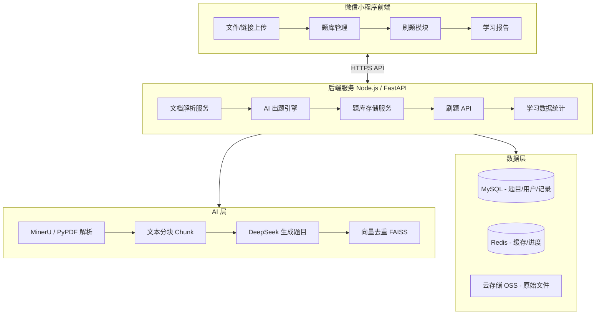
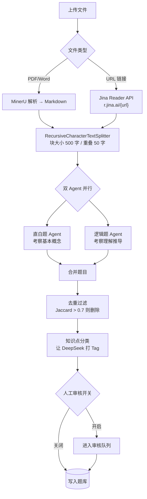

# 微信刷题小程序 - 设计方案

## 一、整体架构



## 二、核心功能模块

### 1. 文档解析与 AI 出题流程


**Prompt 模板核心逻辑：**

```python
PROMPT = """
你是一位专业的出题专家。请根据以下文档内容，生成 {num} 道题目。
要求：
1. 题型：{types}（单选/多选/判断）
2. 难度分布：简单30%、中等50%、困难20%
3. 每题必须包含：题干、选项A/B/C/D、正确答案、解析说明、知识点标签
4. 输出格式：严格 JSON 数组

文档内容：{context}
"""
```

### 2. 数据库核心表设计

**题目表 `questions`：**
- `id`, `bank_id`, `type`（single/multi/judge）
- `content`（题干富文本）, `options`（JSON 数组）
- `answer`（正确答案）, `explanation`（解析）
- `tags`（JSON 知识点标签）, `difficulty`（1-5 难度）
- `correct_rate`（历史正确率，动态更新）

**题库表 `question_banks`：**
- `id`, `name`, `description`, `cover`
- `category_id`, `total_count`, `status`
- `source_file`（原始文档 URL）, `created_by`

**用户答题记录表 `answer_records`：**
- `user_id`, `question_id`, `is_correct`, `time_spent`
- `answered_at`, `mode`（practice/exam/review）

**用户学习进度表 `user_progress`：**
- `user_id`, `bank_id`, `last_position`
- `total_answered`, `correct_count`, `starred_ids`（JSON）

### 3. 刷题模式设计（对标驾考宝典）

| 模式 | 说明 | 技术要点 |
|------|------|----------|
| 顺序练习 | 按题库顺序逐题作答，记录断点续做 | 存储 `last_position` |
| 随机练习 | 打乱顺序，碎片化学习 | Fisher-Yates 洗牌 |
| 章节/分类练习 | 按知识点标签筛题 | tags 字段索引查询 |
| 错题复习 | 专攻答错题目 | 查 `answer_records` 中 `is_correct=false` |
| 收藏练习 | 复习手动收藏的难题 | `starred_ids` 字段 |
| 模拟考试 | 计时、随机抽题、交卷出分 | 前端沙盒计时器 + 批量判分 |

### 4. 小程序前端页面结构

```
pages/
├── index/          # 首页：题库列表 + 学习进度卡片
├── upload/         # 上传文档/输入链接
├── generating/     # AI 生成中（进度动画）
├── bank-detail/    # 题库详情：分类标签 + 开始练习入口
├── practice/       # 刷题核心页（顺序/随机/错题）
├── exam/           # 模拟考试页（答题卡 + 倒计时）
├── result/         # 考试结果 + 错题分析
├── wrong-book/     # 错题本
├── profile/        # 个人学习统计
└── manage/         # 题库管理（管理员：审核/编辑题目）
```

## 三、技术选型

| 层次 | 选型 | 理由 |
|------|------|------|
| 小程序前端 | 微信原生 WXML + WeUI | 性能最优，官方支持 |
| 后端框架 | Python FastAPI | 与 AI 生态集成成本最低 |
| AI 出题 | DeepSeek API + LangChain | 中文效果优秀，成本低 |
| 文档解析 | MinerU API（PDF/Word）+ Jina Reader（URL） | 支持公式、表格、OCR |
| 向量去重 | FAISS + Jaccard 相似度 | 避免重复题目 |
| 主数据库 | MySQL 8.0（腾讯云 CDB）| 结构化题目数据 |
| 缓存 | Redis（腾讯云 Redis）| 进度缓存、防重复提交 |
| 文件存储 | 腾讯云 COS | 存储原始文档 |
| 部署 | 腾讯云 CVM + 云函数 | 与微信生态集成好 |

## 四、AI 出题引擎详细设计



## 五、MVP 开发阶段规划

**阶段一（第 1-2 周）— 核心闭环**
- 后端：FastAPI 基础框架 + PDF 解析 + DeepSeek 出题接口
- 前端：上传页 + 顺序练习页 + 错题本页

**阶段二（第 3-4 周）— 刷题体验完善**
- 模拟考试模式（计时 + 答题卡）
- 分类/章节练习
- 个人学习报告页

**阶段三（第 5-6 周）— 智能提升**
- Word 文档 + URL 链接解析支持
- 题目人工编辑/审核后台
- 错题智能推送（根据正确率动态加权）

## 六、关键接口设计

```
POST /api/upload          # 上传文件，返回 task_id
GET  /api/task/{id}       # 查询出题进度（SSE 推送进度）
GET  /api/banks           # 获取题库列表
GET  /api/questions       # 分页获取题目（支持 mode/tag/difficulty 筛选）
POST /api/answer          # 提交答案，返回是否正确+解析
GET  /api/wrong-questions # 获取用户错题列表
GET  /api/stats           # 获取学习统计数据
```
